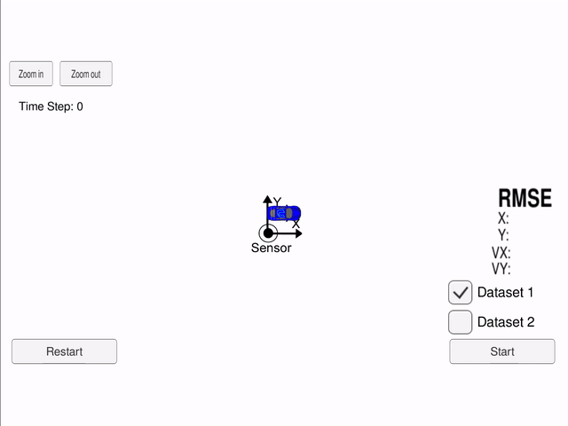

# Extended Kalman Filter Project

This repository contains my solution for the project "Extended Kalman Filter Project" of the Udacity Self-Driving Car Engineer Nanodegree Program. A description of a basic setup can be found in the [original repository](https://github.com/udacity/CarND-Extended-Kalman-Filter-Project). The written code could be found in the files [FusionEKF.cpp](./src/FusionEKF.cpp), [kalman_filter.cpp](./src/kalman_filter.cpp), [tools.cpp](./src/tools.cpp) and their corresponding header files.

The following part of the README contains a very short writeup which describes what is done.

---

In this project an Extended Kalman filter is implemented to combine laser and radar measurements to predict the location of a car.

In the file [FusionEKF.cpp](./src/FusionEKF.cpp) the initialization and logic of the EKF is implemented. On an arriving measurement first the prediction step is preformed and then the update step. If there are both laser and radar measurements at almost the same time the second prediction step is skipped to gain some performance. If the arriving measurement is the first measurement the EKF is initialized instead of preforming a prediction update step.

In the file [kalman_filter.cpp](./src/kalman_filter.cpp) the computation of the prediction and update step is done. These computations simply follow the equations for an EKF.

In [tools.cpp](./src/tools.cpp) there are functions for calculating the error RMSE and for computing the Jacobian matrix for a given state.

---

Running the implementation with the [simulator](https://github.com/udacity/self-driving-car-sim/releases) leads to the following results for the RMSE:

| RMSE | Dataset 1 Both | Dataset 1 Laser | Dataset 1 Radar | Dataset 2 Both | Dataset 2 Laser | Dataset 2 Radar |
|------|----------------|-----------------|-----------------|----------------|-----------------|-----------------|
| X    | 0.0973         | 0.1473          | 0.2302          | 0.0726         | 0.1169          | 0.2706          |
| Y    | 0.0855         | 0.1153          | 0.3464          | 0.0965         | 0.1260          | 0.3853          |
| VX   | 0.4513         | 0.6383          | 0.5835          | 0.4216         | 0.6227          | 0.6524          |
| VY   | 0.4399         | 0.5346          | 0.8040          | 0.4932         | 0.6024          | 0.9218          |

As one can see combining laser and radar measurements significantly improve the performance if as one would only use one sensor. Additionally the data shows that the laser measurements provide a way more accurate prediction. While the VX, VY RMSE of the radar sensor is not that bad compared to the laser sensor, the RMSE of X and Y is up to 3 times higher for the radar sensor. The reason for this should be that the position X and Y can only be measured indirectly by the radar sensor while the laser sensor measures it directly.

Here are two GIFs showing the performance of the implementation on the given Datasets.

Dataset 1:

Dataset 2:

# Build & Run

### Dependencies

* cmake >= 3.5
* make >= 4.1 (Linux, Mac), 3.81 (Windows)
* gcc/g++ >= 5.4

### Basic Build Instructions

1. Clone this repo.
2. Make a build directory: `mkdir build && cd build`
3. Compile: `cmake .. && make`
4. Run it: `./ExtendedKF `
